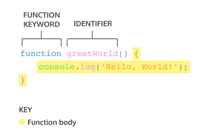
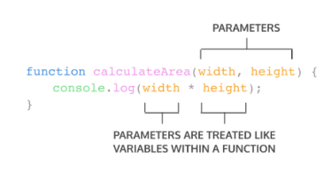
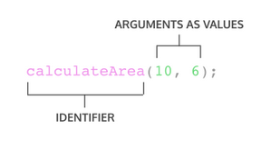
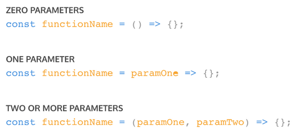
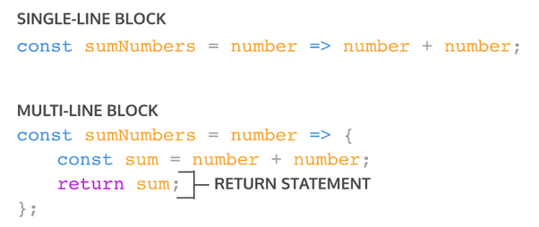
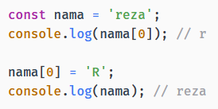
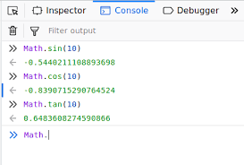
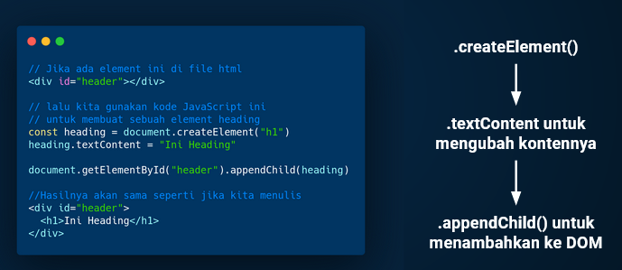
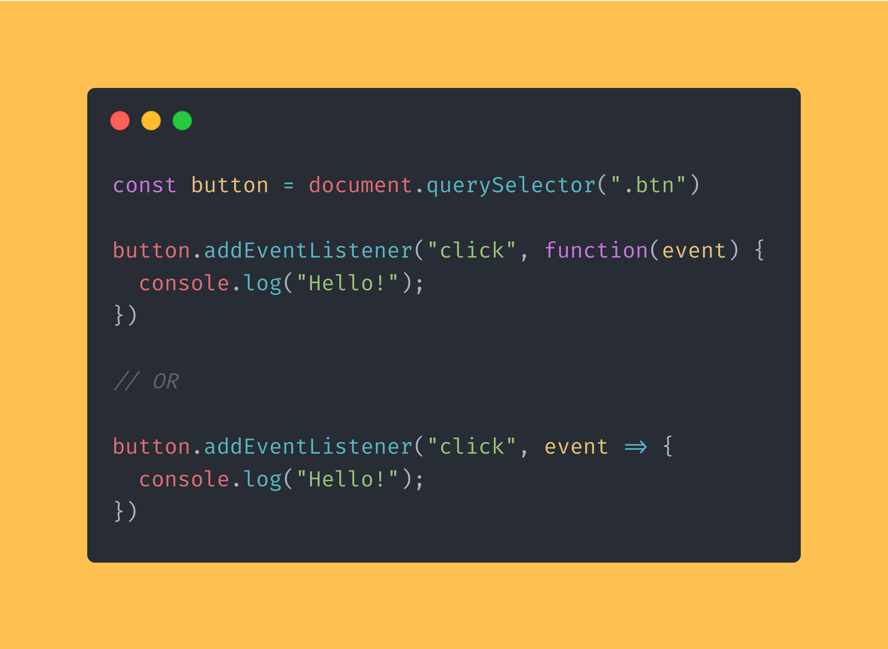

# Scope in Javascript

## Scope
Scope merupakan konsep didalam flow data variabel untuk menentukan suatu variable dapat di akses pada scope tertentu dapat di akses atau tidak. 

## Block
Block merupakan sebuah simbol yang digunakan untuk membatasi sebuah kodingan atau code yang berada di dalam curly braces "{ kode }" yang biasa digunakan pada conditional, function dan looping.  

## Macam-macam Scope
Scope pada sebuah pemrograman bisa dibagi menjadi 2 bagian yaitu Global Scope dan Local Scope.  
1. Global Scope merupakan scope yang bisa di akses secara global atau bisa di akses dimanapun.  
  
2. Local Scope merupakan scope yang hanya bisa di akses di dalam sebuah block tersebut yaitu Function, conditional dan looping.  


# Function in Javascript
Function merupakan sebuah rangkaian kode atau block kode yang tersusun menjadi 1 grup untuk menyelesaikan sebuah fitur yang akan di jalankan nantinya. Fitur yang kita buat ini akan kita jalankan nantinya agar mempermudah kita untuk menggunakan kode yang akan di gunakan di banyak tempat, misalnya kita akan menggunakannya berulang kali.  

## Membuat sebuah Function
Dalam membuat sebuah fungsi atau function di dalam sebauh bahasa pemrograman javascript bisa mengawalinya dengan perintah function lalu dilanjutkan dengan nama identitasnya dan harus ditambah dengan () setelah nama identitasnya.  


## Memanggil sebuah Function
Untuk memanggil sebuah function di javascript kita cukup dengan menyebut nama identitasnya dengan di tambah () di bagian akhir maka fungsi yang sudah kita buat tersebut akan terpanggil berdasarkan nilai atau kode yang ada didalamnya.  


## Parameter & Argumen  
Dalam sebuah fungsi kita dapat mengenal istilah Parameter & Argumen, lalu apa sih mereka itu?. Parameter merupakan sebuah variabel yang digunakan untuk mendeklarasikan fungsi, sedangan argumen merupakan nilai dari parameter itu sendiri saat proses pemanggilan sebuah fungsi. Biasanya parameter digunakan 1 atau lebih guna untuk mendeklarasikan nilai dari sebuah fungsi yang ada didalamnya.  



Nah itu adalah pengertian dari parameter dan argumen. Jadi jika fungsi yang kita buat ingin memiliki nilai sesuai dengan kebutuhan user maka kita perlu menambahkan sebuah parameter, disisi lain kita disarankan untuk menambahkan debuah default parameter. Default parameter digunakan untuk memberikan nilai awal dari sebuah parameter yang berguna untuk menjaga function kita terhindar dari bug/error saat dipanggil tanpa argumen.

## Macam-macam cara penulisan function

Berikut ini adalah macam-macam cara penulisan function : 



# Tipe Data
Tak lengkap rasanya saat kita membahas sebuah bahasa pemrograman tanpa membahas tipe datanya. Pada javascript sama seperti bahasa pemrograman pada umumnya juga memiliki beberapa tipe data yang bisa kita gunakan untuk membuat sebuah program. Tipe-tipe data tersebut bisa kita gunakan untuk membuat sebuah nama, keputusan maupun membuat sebuah penjumlahan. Berikut adalah tipe data yang bisa kita gunakan di javascript :
1. Number/Integer (Bilangan bulat)
2. String (Teks)
3. Boolean (Nilai true and false)
4. Float (Bilangan pecahan)
5. Object

Cara penggunaan tipe data tersebut sama seperti kita mendeklarasikan sebuah variable. Pertama ialah kita membuat sebuah variable apapun yang digunakan untuk menampung nilai dari tipe data tersebut lalu mendeklarasikan tipe data apa saja yang di inginkan. Contohnya adalah sebagai berikut :   
1. var nama = "Yogi Surya Prana"
2. let umur = 21
3. let jomblo = false

Contoh tersebut adalah cara kita untuk mendeklarasikan sebuah tipe data. Jadi jika kita menggunakan tanda kutip untuk mendeklarasikan nilai didalam variable maka akan dibaca sebagai tipe data string, dan jika kita mendeklarasikan nilai 21 dan false maka akan dibaca tipe data number dan boolean begitu juga dengan yang lainnya.

## Tipe data primitif dan non-primitif
Nah setelah mengetahui macam-macam variable maka kita akan berlanjut untuk membedakan manasih tipe data primitif dan non-primitif. Tipe data primitif merupakan tipe data yang bisa menyimpan 1 nilai dalam 1 waktu dan tidak bisa diubah dengan cara yang sama seperti tipe data non-primitif, sedangkan tipe data non-primitif merupakan tipe data yang dapat menyimpan lebih dari 1 nilai dan dapat diubah.
### contoh tipe data primitif
  

### contoh tipe data non-primitif
  


## Math
Jika kita ingin membuat sebuah perhitungan didalam program kita maka kita harus membuat sebuah rumus-rumus yang akan membuat kita pusing atau lama. Hal itu bisa kita atasi dengan Math, Math di javascrip adalah objek yang berisi method (fungsi) dan berbagai konstanta matematika. Method atau fungsi yang tersedia biasanya digunakan untuk pemangkatan, akar kuadrat, logaritma, dan trigonometri. Objek Math pada Javascript digunakan untuk membantu kita dalam membuat perhitungan matematika seperti sin, cos, tan, eksponen, akar kuadrat, dll.menjadi lebih mudah.  


# DOM (Document Object Model)
DOM (Document Object Model) merupakan interface yang memungkinkan user untuk memanipulasi halaman web dari segi tampilan, struktur dan kontennya. DOM memiliki fungsi yang digunakan pada website untuk membuat website tersebut menjadi dinamis. Awal mulanya website yang kita buat merupakan website static dan setelah munculnya DOM ini membantu kita untuk memanipulasi isi dari halaman website yang kita buat dengan mudah. Hal yang perlu kita ketahui adalah DOM bukan bagian dari javascript melainkan adalah bagian dari browser (Web API).  
Dalam membuat sebuah website pernahkah anda bertanya bagaimanakah cara kita untuk menghilangkan sebuah element dari html jika kita mengklik sebuah tombol? Nah jawabannya adalah kita bisa menggunakannya dengan DOM. contoh dari penggunaan sebuah DOM juga bisa kita lihat pada slider di website. Fungsi-fungsi lain dari DOM adalah :
1. Mengubah nilai dari css.
2. Menghapus element html.
3. Menambahkan element baru.
4. Memodifikasi element

## Memanggil/mencari element html
Sebelum melakukan DOM pada web, kita akan mencari terlebih dahulu element-element yang akan dilakukan DOM ini. Untuk memanggil element-element tersebut bisa kita gunakan berbagai cara seperti dibawah ini :

1. document.getElementByID("id-element") //mencari element menggunakan id
2. document.getElementByClass("class-element") //mencari element menggunakan class
3. document.querySelector("#id-element elemen") // mencari element berdasarkan kombinasi selector
Ketiga cara tersebut bisa kita gunakan untuk memanggil element yang akan kita lakukan DOM.

## Mengubah konten element
Setelah kita memanggil elementnya maka kita akan mencoba untuk memodifikasi konten dari element tersebut. Caranya cukup mudah jadi untuk simpelnya kita akan menaruh element yang kita panggil tadi ke dalam sebuah variable lalu setelah itu ketik apa yang akan kita modifikasi dari element tersebut. Contoh perintahnya ialah :
1. variableElement.innerHTML("Mengubah konten HTML di element ini").
2. variableElement.textContent("Mengubah teks yang ada di element ini").
3. variableElement.style.property = "value css" //keterangan property merupakan property yang ada di css contohnya color dan dilanjutkan dengan valuenya.

## Membuat element HTML
DOM juga bisa kita gunakan untuk membuat sebuah element baru yang belum pernah di gunakan di HTML. Cara menggunakannya sama seperti sebelumnya yaitu kita tampung element yang sudah kita panggil sebelumnya kedalam variable dilanjutkan dengan memanggil perintah untuk menambahkan element. Berikut merupakan urutan dalam pembuatan sebuah element baru.  


## Event in DOM
Dalam sebuah DOM kita juga mengenal event yang dimana event ini digunakan untuk melakukan interaksi antara pengguna dan sistem yang kita buat. Contohnya adalah saat kita mengklik sebuah tombol di website maka akan muncul pesan peringatan, nah hal tersebut bisa kita gunakan menggunakan event didalam DOM. Ada beberapa cara untuk membuat sebuah event ini yaitu menggunakannya di dalam element html dan menggunakannya di dalam file javascript.  
  
Cara penggunaan event pada gambar diatas adalah menggunakan file yang terpisah atau kita bisa gunakan didalam script. Cara memanggil eventnya yaitu dengan memanggil elementnya terlebih dahulu lalu tambahkan perintah :
```
variableElement.addEventListener("event",function(event){
    alert("Ini adalah hasil dari event yang kita laksanakan");
})
```
dan kita juga bisa menggunakan perintah seperti pada gambar dibawah ini.  
  
petintah event bukan hanya digunakan untuk onclick saja tetapi masih banyak perintah event yang lainnya. Berikut adalah beberapa perintah event yang saya dapat kita dapatkan di internet.
