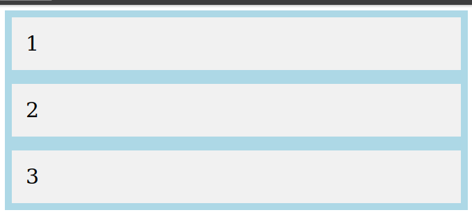
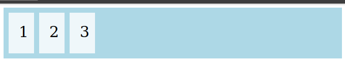

# Javascript Asynchronous
## API
API adalah singkatan dari Application Programming Interface. API sendiri merupakan interface yang dapat menghubungkan satu aplikasi dengan aplikasi lainnya.

Dengan kata lain, peran API adalah sebagai perantara antar berbagai aplikasi berbeda, baik dalam satu platform yang sama atau pun lintas platform.   
## Fetch API
Fetch API pada javascript adalah kegiatan untuk meminta/request layanan ke endpoint/letak url yang akan menerima request pada website secara local maupun public, untuk mengambil response resource / sumber daya berupa data berformat json atau text yang biasa dilakukan programmer untuk membangun website yang membutuhkan data dari website lain ataupun website yang membutuhkan konsep microservice didalamnya.

### Menggunakan Fetch
untuk menggunakan fetch api pada javascript kita bisa menanggunakan perintah fetch lalu di lanjutkan dengan perintah berikut.
```javascript
fetch("https://web.com/api/")
.then((res) => res.json())
.then((data) => console.log(data))
.catch((err) => console.log(err))
```
Pada perintah tersebut terdapat beberapa kondisi yaitu then jika kondisi api berhasil dan catch jika terjadi sebuah error.
## Asynch / Await  
Async / await adalah salah satu fitur baru dari javascript yang di gunakan untuk menangani hasil dari sebuah promise. Caranya adalah dengan menambahkan kata ‘async’ di depan sebuah fungsi untuk mengubahnya menjadi asynchronous.Sedangkan await berfungsi untuk menunda sebuah kode di jalankan, sampai proses asynchronous berhasil.

```javascript
const getStatus = (url) => {

  console.log(`Downloading from ${url}...`);

  return new Promise((resolve, reject) => {

    setTimeout(() => {

      resolve('Download Complete');

    }, 3000);

  });

};

async function download(url) {

  let status = await getStatus(url); // tunggu sampai promise selesai

  console.log(status);

}

const url = 'https://brachio.site/download';

download(url);
```

# GIT & GITHUB
## VCS (Version Control System)
Version Control System (VCS) adalah sebuah sistem yang mencatat setiap perubahan terhadap sebuah file dalam hal ini kode program, sehingga pada suatu saat kita ingin mengembalikan file ke versi sebelumnya dapat dilakukan.  


## Git
Git merupakan software berbasis Version Control System (VCS) yang bertugas untuk mencatat perubahan seluruh file atau repository suatu project. Developer software biasa menggunakan Git untuk distributed revision (VCS terdistribusi), hal ini bertujuan untuk menyimpan database tidak hanya ke satu tempat. Namun semua orang yang terlibat dalam penyusunan kode dapat menyimpan database ini.

## Github   
GitHub merupakan layanan cloud yang berguna untuk menyimpan dan mengelola sebuah project yang dinamakan repository (repo git). Cara kerja pada GitHub harus terkoneksi pada internet sehingga tidak perlu meng-install sebuah software ke dalam perangkat keras. Hal ini memberikan keringanan penyimpanan komputer yang kita gunakan karena file project tersimpan oleh cloud GitHub.

## Perbedaan Git & Github
Berdasarkan penjelasan sebelumnya kita dapat simpulkan git & github adalah hal yang berbeda karena git merupakan sebuah VCS sedangkan github merupakan sebuah layanan cloud untuk tempat menyimpan sebuah project. Git masi kita gunakan di dalam localhost maka dari itu ia bersifat offline terkecuali jika kita ingin mengupload project kita maka kita akan push project tersebut melalui git ke github.

## Perintah Git
Adapun perintah dasar yang harus perlu kita ketahui sebelum kita memulai menggunakan github.  
* **git config**  
Salah satu perintah git yang paling banyak digunakan adalah git config, yang bisa digunakan untuk mengatur konfigurasi tertentu sesuai keinginan pengguna, seperti email, algoritma untuk diff, username, format file, dll. 
```
git config --global user.email sam@google.com
```
* **git init**  
Perintah ini digunakan untuk membuat repositori baru.
```
git init
```
* **git add**  
Perintah git add bisa digunakan untuk menambahkan file ke index. Contohnya, perintah berikut ii akan menambahkan file bernama temp.txt yang ada di direktori lokal ke index:
```
git add temp.txt
```
* **git commit**  
Perintah git commit digunakan untuk melakukan commit pada perubahan ke head. Ingat bahwa perubahan apapun yang di-commit tidak akan langsung ke remote repository. Gunakan:
```
git commit –m “Isi dengan keterangan untuk commit”
```
* **git push**  
git push adalah perintah git dasar lainnya. Push akan mengirimkan perubahan ke master branch dari remote repository yang berhubungan dengan direktori kerja Anda. Misalnya:
```
git push origin master
```
* **git checkout**  
Perintah git checkout bisa digunakan untuk membuat branch atau untuk berpindah diantaranya. Misalnya, perintah berikut ini akan membuat branch baru dan berpindah ke dalamnya:
```
command git checkout -b <nama-branch>
```
Untuk berpindah dari branch satu ke lainnya, gunakan:
```
git checkout <branch-name>
```
* **git branch**  
Perintah git branch bisa digunakan untuk me-list, membuat atau menghapus branch. Untuk menampilkan semua branch yang ada di repository, gunakan:
```
git branch
```

Untuk menghapus branch:
```
git branch -d <branch-name>
```
* **git merge**  
Perintah merge digunakan untuk menggabungkan sebuah branch ke branch aktif. Gunakan:
```
git merge <nama-branch>
```
* **git clone**  
Perintah git clone digunakan untuk checkout repositori. Jia repositori berada di remove server, gunakan:
```
git clone https://github.com/Y5P/writing-presentation.git
```

* **git remote**  
Perintah git remote akan membuat user terhubung ke remote repository. Perintah berikut ini akan menampilkan repository yang sedang dikonfigurasi:
```
git rmote -v
```
Perintah ini membuat user bisa menghubungkan repository lokal ke remote server:
```
git remote add origin <93.188.160.58>
```
* **git pull**
Untuk menggabungkan semua perubahan yang ada di remote repository ke direktori lokal, gunakan perintah pull:
```
git pull
```
# Responesive Web
Responsive web design atau desain web responsif adalah sebuah teknik atau metode bagi web designer untuk membuat suatu layout website yang dapat menyesuaikan diri sesuai dengan ukuran layar pengguna. Hal ini biasa digunakan untuk mengubah atau menyesuaikan tampilan website menjadi ukuran device barunya seperti desktop ke mobile.  


## Tools Responsive Web
Sebelum memulai koding dalam web responsive, user harus mempersiapkan beberapa tools terlebih dahulu yaitu tools bawaan dari web browsernya contoh pada browser chrome ialah Chrome dev tools. untuk mengaksesnya kita bisa menekan tombol ctrl+shift+j.  
  
dan jika kita ingin merubah tampilan desktop ke mobile pada chrome kita bisa menekan icon di pojok kiri yang berlambang tablet dan HP.
  

## Viewport
Viewport adalah bagian dari halaman situs web yang terlihat oleh pengguna. Tampilannya bisa berubah tergantung pada di medium apa seseorang melihat konten Anda, apakah di laptop/tablet/seluler. Secara sederhana, fungsi meta viewport adalah menetapkan area mana saja yang terlihat di situs web sekaligus menentukan skala kontennya. Bagian ini akan menginstruksikan browser cara merender halaman pada ukuran layar  berbeda.
```html
<meta name="viewport" content="width=device-width, initial-scale=1.0">
```
## CSS Unit
CSS unit adalah satuan untuk menentukan ukuran dari suatu elemen atau kontennya. Misal, jika ingin menentukan margin dari sebuah paragraf, kita bisa memberikan nilai tertentu. Nilai ini akan diikuti oleh satuan (CSS unit). 

### Relative unit
Relative unit berguna untuk mendesain website yang responsif karena ukurannya bisa berubah relatif terhadap parent atau ukuran layar.

Secara umum relative unit bisa dipakai sebagai satuan bawaan website responsif sehingga bisa membantu untuk meng-update style di ukuran layar yang berbeda.
* %: Ukurannya relatif terhadap parent element
* em: Ukurannya relatif terhadap font-size dari elemen saat ini
* rem: Ukurannya relatif terhadap font-size root elemen (<html>). "rem" = "root em"
* ch: Ukurannya mengikuti jumlah karakter (1 karakter sama dengan lebar dari karakter 0/nol font yang sedang aktif)
* vh: Ukurannya relatif terhadap tinggi viewport (ukuran jendela tau aplikasi), 1vh = 1/100 dari tinggi viewport
* vw: Ukurannya relatif terhadap lebar dari viewport. 1vw = 1/100 lebar viewport
* vmin: Ukurannya relatif terhadap ukuran viewport yang lebih kecil (misalnya diorientasi portrait, lebar akan lebih kecil daripada tinggi). 1vmin = 1/100 dari ukuran viewport yang lebih kecil.
* vmax: Sama dengan vmin, dia akan melihat ukuran viewport yang lebih besar
* ex: Ukurannya relatif terhadap tinggi dari karakter "x" kecil font yang sedang aktif.

## Media Query
Media query adalah fungsi dari css untuk menggunakan css tertentu jika syarat yang ditentukan dipenuhi. Media query merupakan komponen penting untuk membuat web responsive layout. Media query digunakan untuk membatasi ruang CSS, artinya CSS yang kita buat melalui media queries ini hanya berjalan di ukuran labar layar tertentu.
```css
@media only screen and (max-width: 600px) {
  body {
    background-color: lightblue;
  }
}
```

## Flexbox vs Grid
Flexbox dan Grids sama-sama berfungsi untuk mengatur tampilan sebuah halaman web menjadi lebih terstruktur dan rapi. Perbedaannya hanya terletak pada arah pembagian dimensinya saja.  

Flexbox hanya dapat mengatur arah pembagian dimensi tampilan hanya secara horizontal saja atau secara vertikal saja sedangkan Grids dapat mengatur arah dimensi tampilan secara horizontal dan vertikal.

## Contoh kode Flexbox dan Grid
### Kode HTMLnya
```html
<div class="container">
  <div class="item1">1</div>
  <div class="item2">2</div>
  <div class="item3">3</div>  
</div>
```
### Flexbox Code
```css
.container {
   display : flex;
   flex-direction : row;
   background-color: lightblue;
}

.container > div {
  background-color: #f1f1f1;
  margin: 10px;
  padding: 20px;
  font-size: 30px;
}

@media (max-width: 700px) { 
    .container {
        flex-direction: column;
    }

    .container>div {
        margin-right: 10px;
        margin-bottom: 10px;
    }
}
```
Output : 

### Grid Code
```css
.container {
  display: grid;
  grid: 80px / 50px 50px 50px;
  grid-gap: 10px;
  background-color: lightblue;
  padding: 10px;
}
.container>div {
  background-color: rgba(255, 255, 255, 0.8);
  text-align: center;
  padding:20px;
  font-size: 30px;
}
```
Output : 


# Bootstrap
Singkatnya Bootstrap adalah framework HTML, CSS, dan JavaScript yang berfungsi untuk mendesain website responsive dengan cepat dan mudah. Jadi jika kita membuat sebuah website menggunakan bootstrap akan memakan waktu yang lebih singkat dari pada membuat sebuah kodingan satu persatu. Untuk menerapkan kode bootstrap sendiri kita cukup memanggil class yang sudah di sediakan oleh bootstrap yang bisa di lihat sendiri di website resminya ke dalam element website kita. Hal-hal yang bisa dilakukan bootstrap untuk website kita ialah : 
* Menciptakan website Mobile Friendly —Berkat sistem grid, proses membuat website mobile friendly tak akan membutuhkan waktu lama.
* Memudahkan resize gambar — Cukup dengan menambahkan class .img-responsive ke gambar, maka gambar tersebut akan otomatis di-resize sesuai ukuran layar pengguna.
* Menambahkan elemen website tanpa ribet — Bootstrap menyediakan berbagai elemen yang bisa langsung Anda gunakan di website. Misalnya, navigasi, menu dropdown, thumbnail, dan sebagainya.
* Membuat website lebih interaktif — Bootstrap juga memungkinkan Anda menggunakan plugin custom JQuery. Jadi, Anda bisa menambahkan berbagai elemen interaktif ke website dengan mudah. Misalnya, popup, transisi, image carousel, dan sebagainya.

## Menggunakan bootstrap
Hal yang perlu kita lakukan sebelum menggunakannya ialah menghubungkan bootstrap dengan website yang kita buat baik itu melalui CDN maupun mendownloadnya. Hal ini perlu untuk kita lakukan sebelum memulai mengkodenya karena jika tidak maka kode bootstrap yang sudah kita buat tidak akan bisa terbaca. Kita perlu menambahkan link css dan script js bootstrap pada web kita.
```html
<link href="https://cdn.jsdelivr.net/npm/bootstrap@5.2.2/dist/css/bootstrap.min.css" rel="stylesheet" integrity="sha384-Zenh87qX5JnK2Jl0vWa8Ck2rdkQ2Bzep5IDxbcnCeuOxjzrPF/et3URy9Bv1WTRi" crossorigin="anonymous">

<script src="https://cdn.jsdelivr.net/npm/bootstrap@5.2.2/dist/js/bootstrap.bundle.min.js" integrity="sha384-OERcA2EqjJCMA+/3y+gxIOqMEjwtxJY7qPCqsdltbNJuaOe923+mo//f6V8Qbsw3" crossorigin="anonymous"></script>
```
Contoh :
```html
<!doctype html>
<html lang="en">
  <head>
    <meta charset="utf-8">
    <meta name="viewport" content="width=device-width, initial-scale=1">
    <title>Bootstrap demo</title>
    <link href="https://cdn.jsdelivr.net/npm/bootstrap@5.2.2/dist/css/bootstrap.min.css" rel="stylesheet" integrity="sha384-Zenh87qX5JnK2Jl0vWa8Ck2rdkQ2Bzep5IDxbcnCeuOxjzrPF/et3URy9Bv1WTRi" crossorigin="anonymous">
  </head>
  <body>
    <h1>Hello, world!</h1>
    <script src="https://cdn.jsdelivr.net/npm/bootstrap@5.2.2/dist/js/bootstrap.bundle.min.js" integrity="sha384-OERcA2EqjJCMA+/3y+gxIOqMEjwtxJY7qPCqsdltbNJuaOe923+mo//f6V8Qbsw3" crossorigin="anonymous"></script>
  </body>
</html>
```

## Coding with Bootstrap
Banyak hal yang dapat dibuat menggunakan bootstrap dengan cepat dan mudah contohnya ialah navbar, slideshow dan lainnya. Tak hanya cepat, bootstrap juga mempermudah pembuatan website kita menjadi responesive karena kebanyakan dari component yang ada di bootstrap sudah responsive. Berikut ialah contoh penerapan kode bootstrap dalam pembuatan sebuah navbar.
```html
<nav class="navbar navbar-expand-lg bg-light">
  <div class="container-fluid">
    <a class="navbar-brand" href="#">Navbar</a>
    <button class="navbar-toggler" type="button" data-bs-toggle="collapse" data-bs-target="#navbarSupportedContent" aria-controls="navbarSupportedContent" aria-expanded="false" aria-label="Toggle navigation">
      <span class="navbar-toggler-icon"></span>
    </button>
    <div class="collapse navbar-collapse" id="navbarSupportedContent">
      <ul class="navbar-nav me-auto mb-2 mb-lg-0">
        <li class="nav-item">
          <a class="nav-link active" aria-current="page" href="#">Home</a>
        </li>
        <li class="nav-item">
          <a class="nav-link" href="#">Link</a>
        </li>
        <li class="nav-item dropdown">
          <a class="nav-link dropdown-toggle" href="#" role="button" data-bs-toggle="dropdown" aria-expanded="false">
            Dropdown
          </a>
          <ul class="dropdown-menu">
            <li><a class="dropdown-item" href="#">Action</a></li>
            <li><a class="dropdown-item" href="#">Another action</a></li>
            <li><hr class="dropdown-divider"></li>
            <li><a class="dropdown-item" href="#">Something else here</a></li>
          </ul>
        </li>
        <li class="nav-item">
          <a class="nav-link disabled">Disabled</a>
        </li>
      </ul>
      <form class="d-flex" role="search">
        <input class="form-control me-2" type="search" placeholder="Search" aria-label="Search">
        <button class="btn btn-outline-success" type="submit">Search</button>
      </form>
    </div>
  </div>
</nav>
```