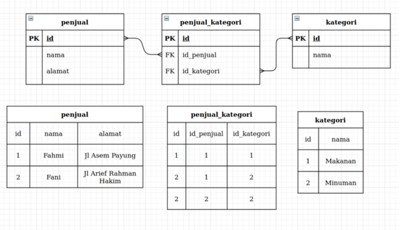

# WEB SERVER & RESTFUL API
## WEB SERVER
Web server adalah sebuah software (perangkat lunak) yang memberikan layanan berupa data. Berfungsi untuk menerima permintaan HTTP atau HTTPS dari klien atau kita kenal dengan web browser (Chrome, Firefox). Selanjutnya ia akan mengirimkan respon atas permintaan tersebut kepada client dalam bentuk halaman web.
### HARDWARE PADA WEB SERVER
Hardware pada web server berfungsi untuk menjadi wadah penyimpanan data yang akan di publish nantinya contohnya adalah komponen web seperti HTML, CSS dan lainnya. Disisi lain web server terhubung langsung ke internet untuk melakukan pertukaran fisik dengan perangkat lainnya yang terhubung ke website.
### SOFTWARE PADA WEB SERVER
Software yang digunakan pada pembangunan sebuah web server berguna untuk mengontrol agar bagaimana pengguna web dapat mengakses sebuah hosting. Seperti penjelasan sebelumnya web server berfungsi sebagai menerima permintaan HTTP/HTTPS dari client dan HTTP lah perangkat lunak yang memahami URL yang dimasukan oleh pengguna.

Cara kerja dari HTTP sendiri memiliki istilah request dan respone contoh penerapannya di kehidupan sehari-hari adalah seperti saat kita berbelanja online yaitu kita memilih barang yang ingin dibeli dan diberitau ke penjual dan respone penjual akan mengirimkan barang tersebut kekita. Seperti itulah prosesnya saat kita membuka sebuah website yang terjadi adalah kita akan mengirimkan request ke server dan server akan meresponenya dengan mengirimkan data dari web servernya berupa tampilan halaman web dan lainnya.
### SERVER SIDE
Server side programming atau pemrograman sisi server adalah suatu program yang berjalan di server yang menangani pembuatan konten halaman website. Perlu diketahui bahwa server side programming memiliki fungsi yang berbeda dengan client side.

Server side merupakan sistem yang berjalan di server, sedang client side merupakan sistem yang berjalan di web browser pengguna. Pada dasarnya server side programming ini memiliki arti yang sama dengan backend scripting.
## RESTFUL API
### REST
REST atau Representational State Transfer adalah salah satu gaya arsitektur yang dapat diadaptasikan ketika membangun web service. Arsitektur ini sangat populer digunakan karena pengembangannya yang relatif mudah. Ia menggunakan pola request-response dalam berinteraksi, artinya ia memanfaatkan protokol HTTP.

Dalam implementasinya arsitektur REST benar-benar memisahkan peran client dan server, bahkan keduanya tidak harus saling mengetahui. Artinya ketika terjadi perubahan besar di sisi client, tidak akan berdampak pada sisi server, begitu juga sebaliknya.
### REST API
Sebagian dari kalian mungkin mengenal Representational State Transfer dengan sebutan RESTful API. Yups, memang benar! RESTful merupakan sebutan untuk web services yang menerapkan arsitektur REST. Ia bisa disebut juga sebagai API (application program interface) karena digunakan untuk menjembatani antara sistem yang berbeda (client dan server).

API atau Application Program Interface sendiri merupakan antarmuka yang menjadi perantara antara sistem aplikasi yang berbeda. API tak hanya dalam bentuk Web Service, bisa saja berupa SDK (Software Development Kit) ataupun lainnya.

#### **Konsep-konsep Rest API**
* **Format Request dan Response**  
REST API sering menggunakan JavaScript Object Notation atau JSON sebagai format data baik pada request ataupun response. Saat ini JSON adalah salah satu format standar dalam transaksi data. JSON sendiri menjadi format terpopuler mengalahkan pendahulunya, yaitu XML. Agar REST API dapat selalu merespon dengan format JSON, pastikan setiap response terdapat properti Content-Type dengan nilai application/json .
* **HTTP Verbs/Methods**  
Karena REST API menggunakan protokol HTTP, maka kita dapat memanfaatkan HTTP verbs (kata kerja) untuk menentukan aksi. Contohnya GET untuk mendapatkan data, POST untuk mengirimkan data baru, PUT untuk memperbarui data yang ada, dan DELETE untuk menghapus data. Verbs tersebut adalah verbs yang umum digunakan dalam operasi CRUD (Create, read, update, and delete).
* **HTTP Respone Code**  
Status-Line merupakan salah satu bagian dari HTTP Response. Dalam status line terdapat response code yang mengindikasikan bahwa permintaan yang client lakukan telah berhasil atau tidak. Maka dari itu, ketika membangun REST API kita perlu memperhatikan dan menetapkan response code secara benar. 


# NODE.JS
Node.js adalah runtime environment untuk JavaScript yang bersifat open-source dan cross-platform. Dengan Node.js kita dapat menjalankan kode JavaScript di mana pun, tidak hanya terbatas pada lingkungan browser.

Node.js menjalankan V8 JavaScript engine (yang juga merupakan inti dari Google Chrome) di luar browser. Ini memungkinkan Node.js memiliki performa yang tinggi. Node.js juga menyediakan banyak library/module JavaScript yang membantu menyederhanakan pengembangan aplikasi web. Node.js mengirimkan/menyimpan data menggunakan format JSON.
## Fitur Node.js
* Single Thread  
Node.js menggunakan model single thread dengan event looping. Mekanisme ini membantu server untuk merespon secara asynchronous dan menjadikan server lebih scalable dibandingkan server tradisional yang menggunakan banyak thread untuk menangani permintaan.
* Asynchronous  
Semua API dari Node.js bersifat asynchronous, artinya tidak memblokir proses lain sembari menunggu satu proses selesai. Server Node.js akan melanjutkan ke ke pemanggilan API berikutnya lalu memanfaatkan mekanisme event notification untuk mendapatkan respon dari panggilan API sebelumnya.
* Very Fast  
Keunggulan lainnya, Node.js memiliki keunggulan dalam kecepatan dalam mengeksekusi kode dengan request yang bersamaan, lebih cepat dibandinkan PHP dan Java. Hal ini didukung oleh komponen V8 engine dari Google. Node.js juga memiliki kecepatan dalam streming data, sehingga dapat menyediakan streaming data yang sangat cepat untuk aplikasi web.
## Module Node.JS
Node.js mempunyai banyak sekali modul yang bisa membantu kita dalam membuat suatu aplikasi. Modul-modul yang sering kita gunakan ialah sebagai berikut :
* Console  
Console merupakan module bawaan dari javascript yang ada di node JS untuk digunakan sebagai debug atau menampilkan code secara interface
```javascript
console.log("Nama saya Yogi Surya Prana");
```
* FS (File System)  
Fs atau “file system” merupakan module yang dapat membantu berinteraksi dengan file yang ada diluar code. FS paling sering digunakan untuk membaca file dengan ekstensi .txt, .csv, dan .json
```javascript
const fs = require('fs');

fs.readFile('namaAing.txt', 'utf8', function(err, data){
    console.log(data); //output : Isi text file
});
```
* Timers  
Timers merupakan modules yang digunakan untuk melakukan scheduling atau mengatur waktu pemanggilan fungsi yang dapat diatur di waktu tertentu
```javascript
function panggilSaya() {
  console.log('Yogi');
}

setInterval(panggilSaya, 1500);

/*
output : 
Yogi
Yogi
Yogi
Yogi
*/
```
* Buffer  
Buffer merupakan modules yang digunakan untuk mengakses, mengelola dan mengubah tipe data raw atau tipe data bytes
```javascript
var buf = Buffer.from('yogi surya prana');
console.log(buf); //output : <Buffer 79 6f 67 69 20 73 75 72 79 61 20 70 72 61 6e 61>
```

## Membuat server dengan Node.js
```javascript
const http = require('http');
const url = require('url');

http.createServer(function(req,res){
    res.writeHead(200, {'Content-Type': 'text/html'});

    let query = url.parse(req.url,true).query;

    res.write(`Hai saya ${query.nama}, saya mengakses halaman ${req.url}`);
    res.end()
}).listen(8081);
```
Output :


Berdasarkan kode dan hasil di atas kita perlu mengetahui beberapa hal terlebih dahulu.  
* **import module http**  
Sebelum membuat sebuah server maka kita harus mengimport terlebih dahulu modulenya yaitu modul http dan di tampung di dalam sebuah variable.
* **http.createServer().listen(8081)**  
Method untuk membuat sebuah server pada module http ialah http.createServer() dan diikuti dengan memasukan port dari server yang akan kita buat. Jika port yang diisi 8081 maka saat kita mengakses web servernya kita perlu menambah dan mengikuti port yang sudah kita tentukan.
* **res.writeHead()**  
Merupakan sebuah method yang digunakan untuk menambahkan header HTTP. Didalamnya terdapat sebuah argumen 200 yang menandakan semuanya baik-baik saja.
* **req.url**  
Argumen req mewakili request dari client sebagai object dan memiliki berbagai property salah satunya ialah url yang berfungsi untuk melihat halaman yang user akses.
* **Module URL**  
module ini berguna untuk menambahkan dan membaca query yang ada pada saat user mengakses website.

# Express JS
Express.js adalah framework web app untuk Node.js yang ditulis dengan bahasa pemrograman JavaScript. Framework open source ini dibuat oleh TJ Holowaychuk pada tahun 2010 lalu.

Express.js adalah framework back end. Artinya, ia bertanggung jawab untuk mengatur fungsionalitas website, seperti pengelolaan routing dan session, permintaan HTTP, penanganan error, serta pertukaran data di server. Express juga mempunyai arsitektur MVC (Model View Control).
## Instalasi Module
* **npm i --save express** digunakan untuk menginstallasi module express.js.
* **npm i --save-dev nodemon** digunakan untuk mempermudah dalam mendevelop sebuah server side application.
## Routing
Routing adalah mekanisme bagaimana sebuah aplikasi me-response permintaan/request client/browser ke endpoint/URL tertentu dan dengan spesifik HTTP request method seperti GET, POST, PUT, PATCH, DELETE dan lain-lain.
```javascript
const express = require('express');
const app = express();
const port = 8082;

app.get('/profile',(req,res)=>{
    res.status(200).json({
        "nama":"Yogi Surya Prana",
        "umur":21,
        "isJomblo":false
    });
});

app.post('/tambah',(req,res)=>{
    res.send("Berhasil menambahkan!");
});

app.delete('/hapus',(req,res)=>{
    res.send("Berhasil menghapus!");
})

app.get('/',(req,res)=>{
    let namaUser = req.query.nama || "User";
    res.send(`Halo ${namaUser}, selamat datang di halaman awal.`);
});

app.listen(port,()=>{
    console.log(`Sebuah aplikasi sedang mengakses http://localhost:${port}/`);
});
```
output halaman awal :

output halaman profile :

* Dalam membuat sebuah route kita bisa memberikan respone dengan memasukan kode res.send("responenya");
* Sangat dianjurkan untuk menambahkan status code didalam sebuah route dengan menambahkan res.status(kodenya);
* Kita bisa menampilkan dengan format json yaitu dengan menambahkan res.json();
* Untuk membaca query kita bisa menambahkan req.query.querynya.

### nested router
Nested route digunakan ketika terdapat banyak route yang memiliki nama yang sama atau ingin membuat route yang lebih mendalam.
```javascript
const express = require('express');
const app = express();
const port = 8082;
const profile = express.Router();

app.use("/profile",profile);

profile.get("/nama",(req,res)=>{
    res.send("Yogi Surya Prana");
});

profile.get("/umur",(req,res)=>{
    res.send("21 Tahun");
});

app.listen(port,()=>{
    console.log(`Sebuah aplikasi sedang mengakses http://localhost:${port}/`);
});
```


## Middleware
Middleware pada dasarnya adalah ‘penengah’. Kalau dalam aplikasi middleware adalah sebuah aturan yang harus dilewati terlebih dahulu sebelum masuk kedalam sebuah sistem atau keluar dari sebuah sistem.

Analoginya seperti ini, misalnya teman-teman ingin mendaftar di sebuah pekerjaan yaitu menjadi seorang programmer, maka sebelum teman-teman masuk menjadi karyawan, harus melewati prosedur terlebih dahulu. Misalnya, teman-teman akan dicek apakah usianya sudah layak untuk bekerja, atau teman-teman akan di interview terlebih dahulu, atau mengerjakan test untuk mengetahui skillnya terlebih dahulu. Nah, semua tahapan-tahapan tersebut disebut dengan middleware.
```javascript
const express = require("express");
const app = express();
const port = 8082;

const berhasil = function(req,res,next){
    console.log("berhasil");
    next();
}

const addWaktu = function(req,res,next){
    req.requestTime = Date.now();
    req.nama = "Yogi Surya Prana"
    next();
}

app.use(addWaktu);

app.get("/",(req,res)=>{
    let kalimat = (`halo ${req.nama}, `);
    kalimat+=` respone pada : ${req.requestTime}`;
    res.send(kalimat);
});


app.listen(8082,()=>{
    console.log(`port : ${port}`);
});
```
output : 


# Database with MySQL
Database adalah tempat untuk menyimpan dan mengelola data. Kata “relasional” berarti data yang disimpan di dataset dikelola sebagai tabel. Setiap tabel saling terkait. Jika software tidak mendukung model data relasional, maka yang dipanggil hanyalah DBMS.

## Relasi database
Database relasional adalah kumpulan item data dengan hubungan yang telah ditentukan sebelumnya. Berbagai item ini disusun menjadi satu set tabel dengan kolom dan baris. Tabel digunakan untuk menyimpan informasi tentang objek yang akan direpresentasikan dalam database. Tiap kolom pada tabel memuat jenis data tertentu dan bidang menyimpan nilai aktual atribut. Baris pada tabel merepresentasikan kumpulan nilai terkait dari satu objek atau entitas. Tiap baris pada tabel dapat ditandai dengan pengidentifikasi unik yang disebut kunci utama, dan baris di antara beberapa tabel dapat dibuat saling terkait menggunakan kunci asing. Data ini dapat diakses dengan berbagai cara tanpa menyusun ulang tabel basis data itu sendiri.
### Macam-macam relasi database
* **one-to-one**  
Relasi One to One adalah relasi dimana suatu baris tabel A hanya berhubungan dengan suatu baris tabel B. Perhatikan gambar dibawah ini.

Dari gambar tersebut tabel penjual memiliki relasi one to one dengan tabel kota, sebagai contoh terdapat penjual bernama fahmi dengan alamat jl asempayung yang berada di kota surabaya.
* **one-to-many**  
Relasi One to Many adalah relasi dimana suatu baris di table A memiliki relasi di beberapa baris di table B. Perhatikan gambar berikut.

Contohnya adalah hubungan antara tabel penjual dan tabel produk, dimana 1 penjual memiliki beberapa produk. contohnya penjual bernama fahmi memiliki 2 produk yaitu pecel lele, dan tempe penyet.
* **many-to-many**  
Relasi Many to Many adalah relasi dimana setiap lebih dari satu baris data dari tabel A berhubungan dengan lebih dari satu baris data pada tabel B. Artinya, kedua tabel masing-masing dapat mengakses banyak data dari tabel yang direlasikan. Maka dari itu, relasi Many to Many butuh tabel C sebagai perantara tabel A dan tabel B

Sebagai contoh pada gambar diatas, beberapa penjual memiliki hubungan dengan beberapa kategori. misal penjual A kategori Makanan dan Minuman, sedangkan penjual B kategorinya adalah Minuman saja. jika dibuat relasinya One to One atau One to Many akan kesusahan. maka dari itu butuh tabel perantara yang bernama penjual_kategori sebagai pengubung tabel penjual dan tabel kategori.