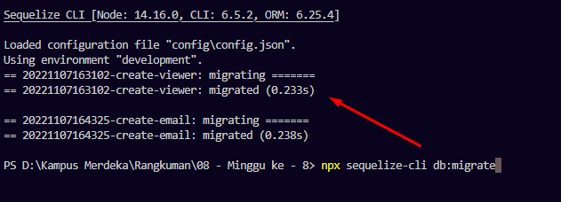

# Backend Development
Back end merupakan sisi server atau server side dari sebuah website atau aplikasi. Jadi, back end developer adalah seorang yang memiliki keahlian untuk merancang atau mengembangkan software di sisi server yang berkaitan dengan logika serta database.

Tujuannya adalah untuk memastikan bahwa aplikasi/website dapat tampil dan berguna dengan sebagaimana mestinya. Secara umum, tugas seorang back end developer yaitu melakukan pengecekan terhadap berbagai program inti dan fitur yang terdapat di balik software.

Back end developer juga harus mengelola basis data serta mengatur integrasi API. Intinya, back end developer harus memastikan bahwa seluruh program di balik software bisa berjalan dengan sempurna. 

## Bahasa Pemrograman Backend
Pada backend development ada beberapa bahasa pemroraman yang bisa kita gunakan, yaitu :  
* Javascript
* Java
* Python
* PHP
* Golang

# Database
Database atau basis data adalah kumpulan data yang dikelola sedemikian rupa berdasarkan ketentuan tertentu yang saling berhubungan sehingga mudah dalam pengelolaannya. Melalui pengelolaan tersebut pengguna dapat memperoleh kemudahan dalam mencari informasi, menyimpan informasi dan membuang informasi.
## DBMS (Database Manajement System)
DBMS adalah singkatan dari Database Management System. Sedangkan pengertian DBMS adalah software yang digunakan untuk mengelola database, atau kumpulan data yang saling terhubung satu sama lain. 

Dengan kata lain, di dalam sebuah DBMS terdapat satu atau banyak database. Berkat adanya DBMS, setiap data dapat dikelola, dimanipulasi, dan diolah menjadi bentuk informasi baru.
## SQL (Structured Query Language)
Structured Query Language adalah Bahasa Query yang digunakan untuk melakukan interaksi di RDMS (Relational Database Management System).
## DDL (Data Definition Language)
merupakan kumpulan perintah SQL yang digunakan untuk membuat, mengubah dan menghapus struktur dan definisi metadata dari objek-objek Database.
## MYSQL
MySQL adalah sistem manajemen database relasional (RDBMS) open-source berbasis SQL yang bekerja dengan model client-server. Kalau DBMS adalah sistem manajemen database secara umum, RDBMS merupakan software pengelolaan database berdasarkan model relasional.
## Perintah Dalam Database
Berikut merupakan beberapa perintah yang digunakan dalam memanipulasi database.
### Perintah pada tabel :
* **CREATE** digunakan untuk membuat tabel baru.
* **ALTER** digunakan untuk mengubah struktur tabel.
* **DROP** digunakan untuk menghapus tabel.
### Perintah pada field :
* **SELECT** untuk menyeleksi kolom yang akan di tampilkan datanya.
* **INSERT** untuk menambahkan data/field pada tabel.
* **DELETE** untuk menghapus data/field pada tabel.
* **UPDATE** untuk mengubah data/field pada tabel.

# Authentication & Authorization
## Authentication
Authentication merupakan proses untuk memastikan suatu pengenalan atau memastikan suatu pengakuan. Jadi pada authentication ini akan memastikan siapakah sebenarnya yang telah berinteraksi dengan sistem.

Terdapat beberapa macam variasi Authentication yaitu :
* Single Factor Authentication.
* Two Factor Authentication.
* Multi-Factor Authentication.
## Authorization
authorization adalah proses selanjutnya setelah authentication berhasil. Sistem akan memberikan akses sesuai kebijakan yang sudah ditentukan sebelumnya. Di sini sistem akan memberikan batasan akses yang akan diberikan kepada karyawan yang sudah login tersebut. Tentu saja sebelumnya sudah ada rancangan pembatasan akses untuk mencegah terjadinya fraud atau kecurangan dalam perusahaan.
## Encryption
Encryption atau enkripsi adalah proses untuk membuat suatu susunan acak dari teks yang dapat dibaca oleh manusia (human-readable plaintext) menjadi teks yang tidak dapat dibaca oleh manusia dan hanya dimengerti oleh sistem saja (incomprehensible text). Teks hasil dari enkripsi disebut dengan “ciphertext”.

# Sequelize
Sequelize adalah ORM (Object Relational Mapping) Node JS yang berbasis promise. Sequelize mendukung sebagian besar relational Database seperti MySQL, PostgresQL, MariaDB, SQLite dan Miscrosoft SQL Server.

Dengan fitur fitur di Sequelize, kita bisa mengelola dan mengatur data di database kita dengan cepat, dan efisien

## Installasi & Konfigurasi Sequelize
```javascript
npm install sequelize-cli
npm install --save sequelize
npm install --save mysql2
npx sequelize-cli init
```



